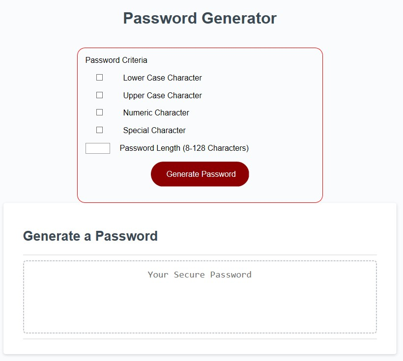
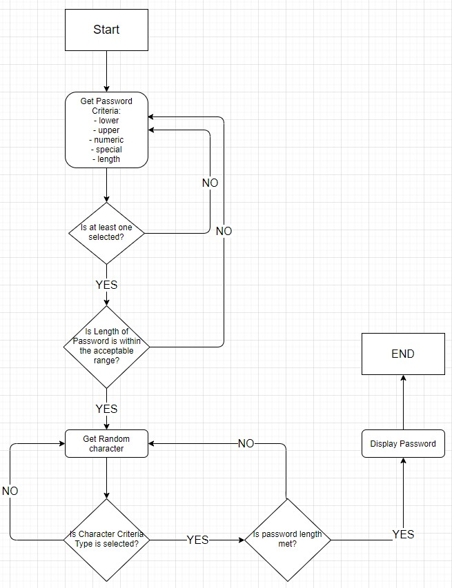
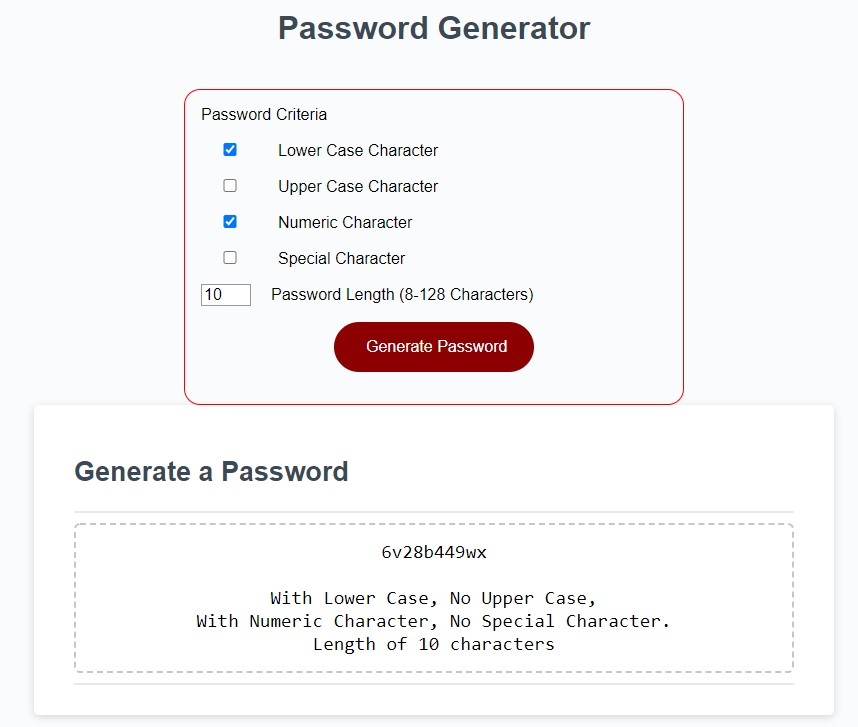
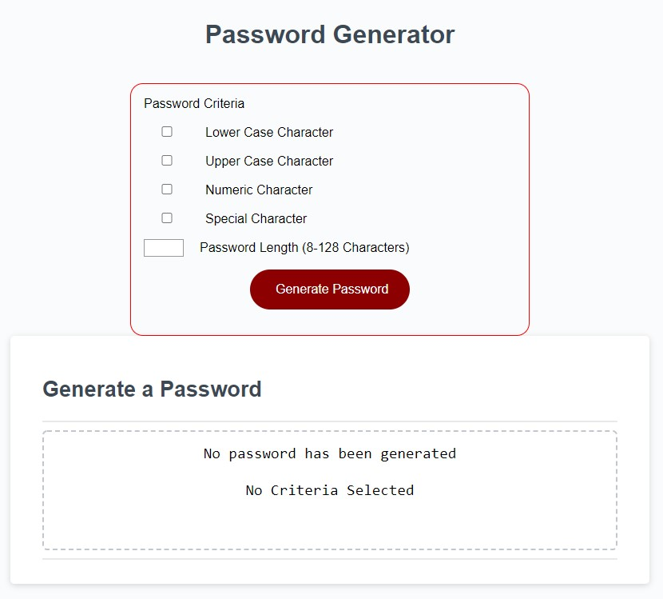
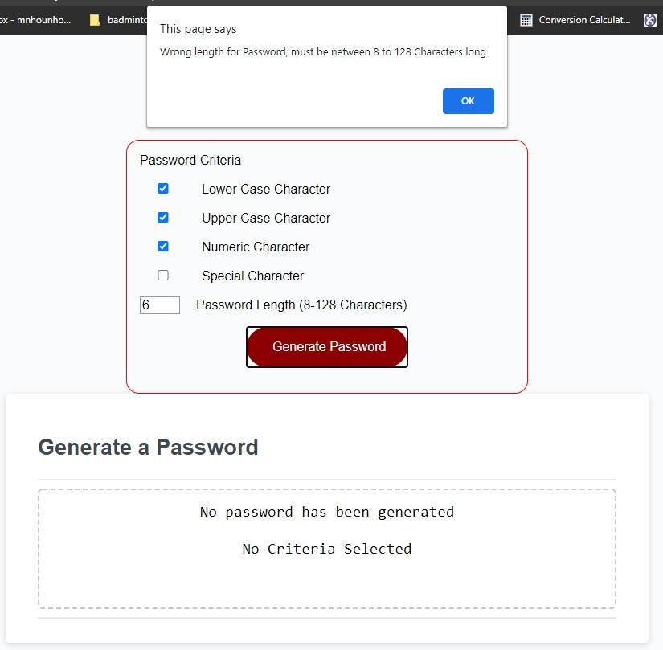

# Welcome to Password Generator!

The intent of this Homework is to create a Password Generator according to the following acceptance Criteria

# Table of Content
- [Acceptance Criteria](#acceptance-criteria)
- [Links](#links)
- [Mock-Up](#mock-up)
- [My Design](#mu-design)
- [My Choice](#my-choice)
- [FlowChart Diagrams](#flowchart-diagrams)
- [Checks and Balances](#checks-and-balances)
- [Results](#results)
- [Errors](#errors)

# Acceptance Criteria
```
GIVEN I need a new, secure password
WHEN I click the button to generate a password
THEN I am presented with a series of prompts for password criteria
WHEN prompted for password criteria
THEN I select which criteria to include in the password
WHEN prompted for the length of the password
THEN I choose a length of at least 8 characters and no more than 128 characters
WHEN prompted for character types to include in the password
THEN I choose lowercase, uppercase, numeric, and/or special characters
WHEN I answer each prompt
THEN my input should be validated and at least one character type should be selected
WHEN all prompts are answered
THEN a password is generated that matches the selected criteria
WHEN the password is generated
THEN the password is either displayed in an alert or written to the page
```

## Links
- GitHub Repo: [https://github.com/nhounhou/PasswordGenerator]
- Live Deployement: [https://nhounhou.github.io/PasswordGenerator/]

## Mock-Up

The following image shows the web application's appearance and functionality:


## My design



## My Choice
I choose not to use the ``Prompt`` and ``Confirm`` commands, as it was not aesthetically appealing to me. But I left the coding of these lines in comments in ``Script.js`` file.
I choose to create a ``Form`` and use the ``Checkbox`` and ``Text`` element to get the user password criteria selection.

## FlowChart Diagrams



## Checks and Balances

The JavaScript function ``generatePassword()`` is getting the parameter ``form``, which the FORM, to be able to get the selected password criteria that the user choose.
Then the function is making sure that at least one of the criteria (lowercase, uppercase, numeric or special character) is selected. If not, then the function will return an error message display on the webpage.
The same check is done with the entry of the password length, that needs to be between 8 and 128 characters long, limits included.

I choose to randomly build the password with each type of character criteria, so I'm checking that for each random character type generated, the criteria for that character is on and so I'm adding it at the end of the password. If the criteria is not selected, I will disregard the random character and get another one.

The loop ``For`` will perform that sequence of command until the length of the password is met.

And display the password in the allocated ``TextArea`` tag.
I also included a confirmation message including which of the criteria has been included, or not, in the password.

## Results



## Errors



